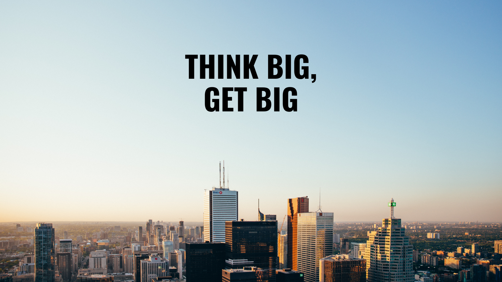

Hello 👋 My name is <strong>Brad Farrington</strong>. I am from Tamworth which is a small town near Birmingham City in the United Kingdom.
I am currently learning web development and have been interested in programming for many years.
I have coded multiple applications using JavaScript and the React Native libraries and i am here to further my knowledge.

I have a huge interest in creating projects from scracth and watchiong my ideas come to life in the form of websites or functional mobile applications for everyday use. 

I am a Director of a family business named Bradley Scott Windows and i built the mobile application for our customers to use enabling them to track their orders and also design their own front doors.

My end goal of my HTML course which i am currently enrolled in is to be able to understand and code javascript and finally building a new website for our business.

I have big dreams and i believe that anything is possible if you put the work in towards it.

## Skills

Working in a team / managing teams / creativity / perservearance

Tools:
- Visual Studio Code
- HTML
- CSS
- JavaScript
- React Native
- GitHub

My goals for 2024:
- Completing my HTML, CSS and JS course
- Building more mobile applications
- Building my family business website
- To further my career as a developer
